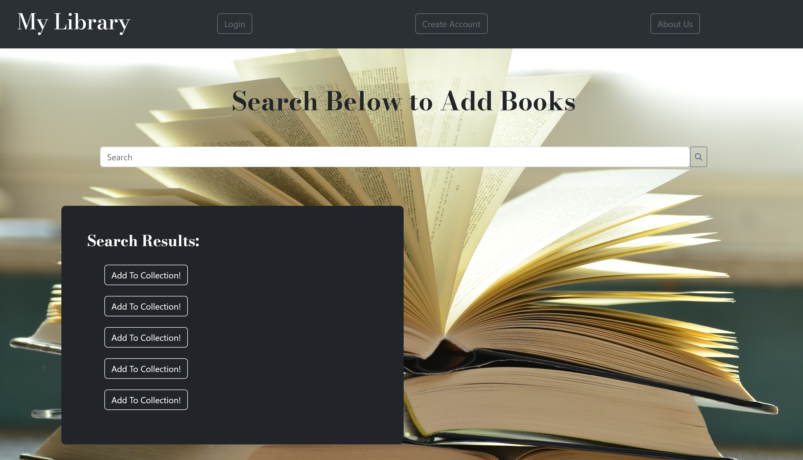

# Project 2 - Digital Library
  
## Description
  
  * This application is a simple library database that allows the user to add and store books they have read to their own personal collection. The purpose of this application is to allow the user to easily view, search for, and record books they have read to make it easier to find and remember all the books they have. For future development, we hope to add an API that will recommend new books based on the previous genres entered into one's collection.
  
  ## Table of Contents
  
  * [Usage](#Usage)
  * [Contributing](#Contributing)
  * [Tests](#Tests)
  * [License](#License)
  * [Acknowledgements](#Acknowledgements)
  * [Questions](#Questions)
  
  ## Usage
  
  * Anyone can access and use this application. The application is live at: 

  * Github repository for source files: https://github.com/madalynmm/library-ghost

  * Link to deployed application: https://secret-chamber-67759.herokuapp.com/
  
  ## Contributing
  
  * This project was created by Alex Biggs, Madalyn Marino, Chris Mizelle, Michael Smitte, and Hunter White. Their GitHub information is listed below.
  
  * **GitHub Profiles of the Creators** 
  * Alex Biggs - **https://github.com/afbiggs**,
  * Madalyn Marino - **https://github.com/madalynmm**,
  * Chris Mizelle - **https://github.com/cmizelle10**,
  * Michael Smitte - **https://github.com/Hochipochi**,
  * Hunter White - **https://github.com/HWhite123**,

  
  ## Tests
  
  * This application has only been tested locally.
  
  ## License
  
  * This application is licensed under the MIT license type.
  
  ## Acknowledgments
  
  * This application uses Node.js, Express.js, Cloudinary npm, Bootstrap, Handlebars, MYSQL, and Sequelize. 
  
  ## Questions
  * If you have any questions regarding the application, please reach out to any of the application creators: **Alex Biggs**, **Madalyn Marino**, **Chris Mizelle**, **Michael Smitte**, or **Hunter White**.
  
  ## Screenshot of the Application

  